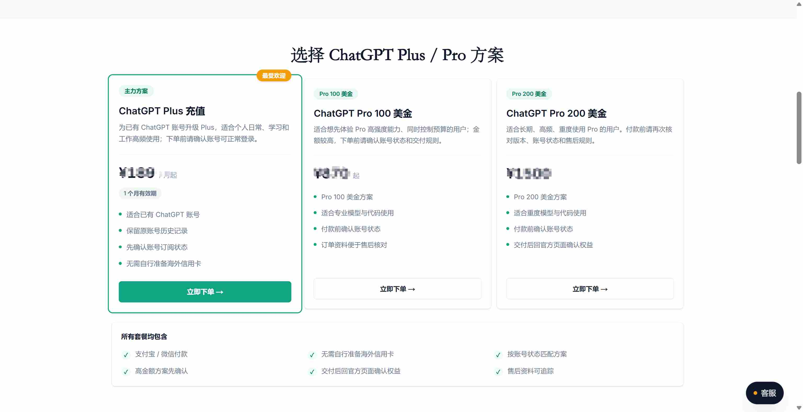
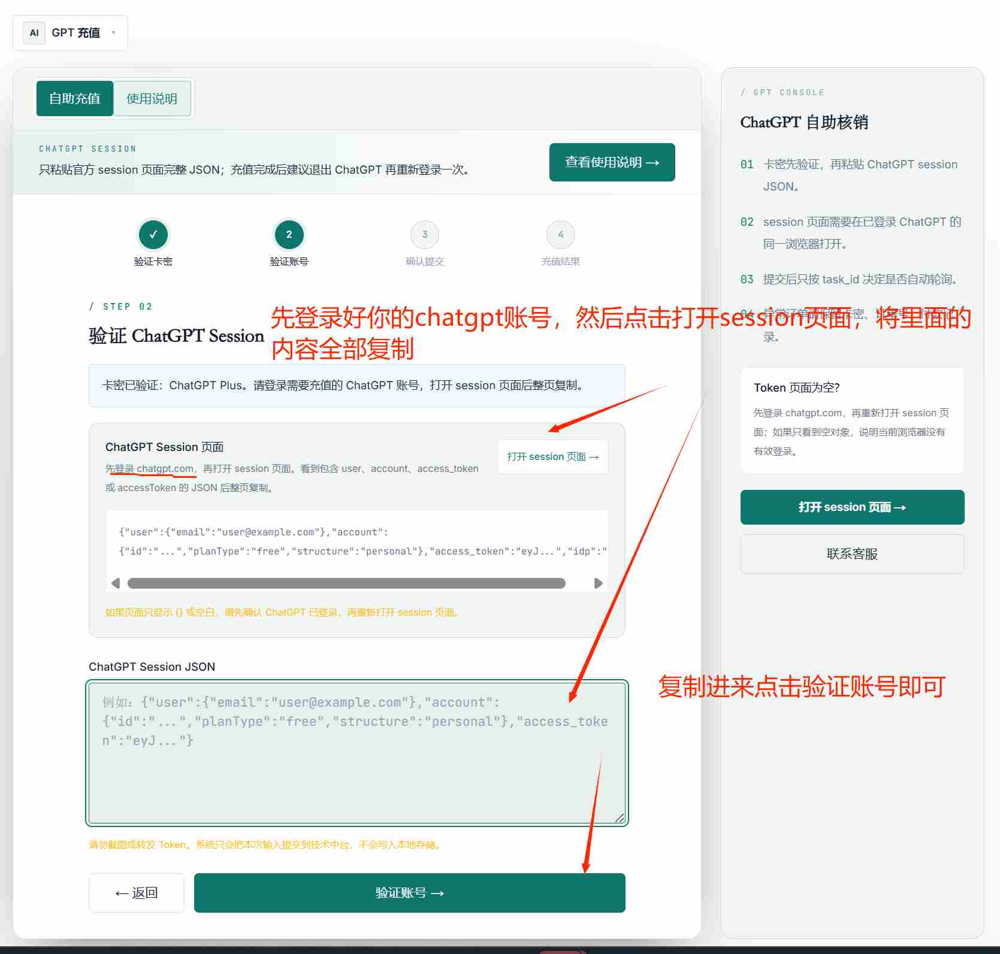
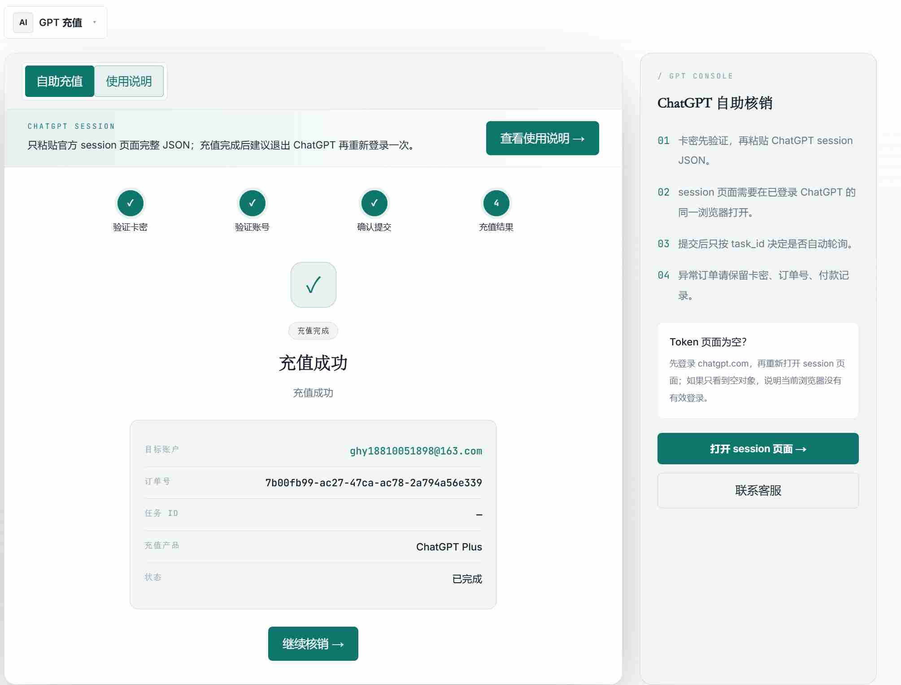

# 2026 国内 ChatGPT Plus / Pro 充值教程：支付宝微信付款、官方订阅升级与常见报错排查

**English summary:** This guide explains how users in China can subscribe to ChatGPT Plus or ChatGPT Pro, compare common payment methods, understand official pricing and feature differences, troubleshoot payment errors such as `Your card has been declined`, and use chonggrok.com as an optional no-password recharge service for ChatGPT subscriptions.

**English keywords:** ChatGPT Plus recharge, ChatGPT Pro recharge, ChatGPT payment declined, ChatGPT subscription China, Alipay ChatGPT Plus, WeChat Pay ChatGPT Pro, chonggrok.com

> 更新时间：2026-07-07  
> 事实来源：ChatGPT 官方价格页、OpenAI Help Center、OpenAI 官方 Pro 发布页。套餐、模型、额度和价格会调整，最终以 ChatGPT 官方页面实时展示为准。

---

## 先说结论

如果你在国内想给自己的 ChatGPT 账号升级 **ChatGPT Plus** 或 **ChatGPT Pro**，常见路线有四种：

1. 自己用海外银行卡或虚拟卡付款；
2. 通过 App Store 礼品卡走 iOS 内购；
3. 购买共享账号；
4. 找支持支付宝/微信的代充服务，给自己的账号完成官方订阅升级。

对大多数普通用户来说，最省时间的方案通常是第四种：**不交账号密码，只按页面要求提交本次升级所需的账号凭证，由服务方用海外卡完成官方付款升级**。

如果你只是想省去外币卡、虚拟卡、Stripe 风控、账单地址和支付失败排查，可以把 **chonggrok.com/chatgpt** 作为一个可选入口。它的定位是 ChatGPT Plus / Pro 会员订阅代充：用户用支付宝或微信付款，账号仍归自己，不需要提供 ChatGPT 密码。

需要提前说明：  
“不要密码”不等于“绝对零风险”。ChatGPT 代充会用到账号凭证，例如 session 类信息，凭证仅用于本次升级；升级后建议退出并重新登录，让旧 session 刷新失效。任何线上订阅服务都不是零风险，承诺“100% 不封号”“绝对安全”“封号包赔”的说法都不可信。

---

## 一、ChatGPT Plus 和 ChatGPT Pro 有什么区别？

截至 2026-07-07，可核实到的官方信息如下：

| 项目                       | ChatGPT Plus                                             | ChatGPT Pro                                                  |
| -------------------------- | -------------------------------------------------------- | ------------------------------------------------------------ |
| 官方价格                   | OpenAI Help Center 写明为 **20 美元/月**                 | OpenAI 2024 年 Pro 发布页写明推出价为 **200 美元/月**；当前 ChatGPT 官方价格页以实时展示为准 |
| 适合人群                   | 大多数日常办公、学习、写作、轻度代码、图片和文件处理用户 | 高频使用者、开发者、研究人员、重度文件处理和复杂推理用户     |
| 模型与推理                 | 官方价格页显示 Plus 包含更高额度与高级推理能力           | 官方价格页显示 Pro 在 Plus 基础上提供更高用量、Pro 级推理、更高 Codex、深度研究、图片和上下文额度 |
| 文件上传 / 数据分析        | 支持，额度高于免费版                                     | 支持，整体额度更高                                           |
| 图片生成                   | 支持                                                     | 支持，官方价格页描述为更高或更快的图片生成能力               |
| Deep Research / Agent Mode | 扩展可用                                                 | 更高额度或更高等级可用                                       |
| Codex                      | 扩展使用                                                 | 更高额度使用                                                 |
| 选择建议                   | 不确定选哪个，先选 Plus                                  | 每天高频使用、经常处理长文档/代码/研究任务，再考虑 Pro       |

官方参考：

- ChatGPT Pricing: https://chatgpt.com/pricing
- What is ChatGPT Plus: https://help.openai.com/en/articles/6950777-what-is-chatgpt-plus
- Introducing ChatGPT Pro: https://openai.com/index/introducing-chatgpt-pro/

简单说：**普通用户先选 Plus，高频用户再考虑 Pro**。不要因为 Pro 更贵就默认它适合所有人，也不要为了“看起来更强”盲目上 Pro。

---

## 二、为什么国内用户经常卡在 ChatGPT 付款？

很多人不是不会用 ChatGPT，而是卡在付款环节。

常见问题包括：

- 国内银行卡绑定失败，提示 `Your card has been declined`；
- 银行或 Stripe 无法完成验证，提示 `We were unable to authenticate your payment method`；
- 虚拟卡要求 KYC、USDT、海外账单地址，门槛越来越高；
- App Store 礼品卡要处理美区 Apple ID、余额、税区和订阅管理；
- 共享账号便宜但聊天记录、文件、隐私和稳定性都不可控；
- 充值成功后不知道是否自动续费、到期如何续费。

这些问题的本质不是“你不会操作”，而是 ChatGPT 官方支付链路对发卡地区、账单地址、网络环境、风控记录和验证方式都有要求。对只想开通 Plus / Pro 的普通用户来说，自己折腾虚拟卡往往时间成本很高。

---

## 三、几种 ChatGPT 充值方式对比

| 方式             | 操作难度 | 隐私与账号安全                     | 稳定性                           | 适合人群                              | 建议           |
| ---------------- | -------- | ---------------------------------- | -------------------------------- | ------------------------------------- | -------------- |
| 官方海外卡直付   | 高       | 账号自主，支付信息自己掌握         | 取决于卡段、账单地址、网络环境   | 有海外卡和海外支付经验的人            | 可选           |
| 虚拟卡           | 高       | 要把身份信息交给发卡平台           | 卡段、3DS、IP 都可能触发风控     | 熟悉虚拟卡和外币支付的人              | 普通用户不优先 |
| App Store 礼品卡 | 中高     | 账号自主，但礼品卡来源要干净       | 受 Apple ID 地区、余额、税区影响 | 只用 iPhone / iPad 且熟悉美区账号的人 | 可选但折腾     |
| 共享账号         | 低       | 隐私风险高，聊天记录和文件可能暴露 | 多人共用容易失效                 | 临时体验且不处理隐私内容的人          | 不建议         |
| 代充自己的账号   | 中低     | 不交密码，但会用到本次升级凭证     | 取决于服务方支付能力和售后       | 想用支付宝/微信、省时间的人           | 可以考虑       |

如果你选择代充，核心判断标准不是“谁说得最夸张”，而是：

- 是否明确不索要 ChatGPT 密码、邮箱密码、邮箱验证码；
- 是否说明会使用哪些账号凭证；
- 是否提醒用户升级后重新登录刷新 session；
- 是否有明确订单和售后；
- 是否避免“100% 不封号”“永久稳定”“零风险”这类绝对承诺。

---

## 四、可选方案：通过 chonggrok.com 给自己的 ChatGPT 账号升级

如果你不想办虚拟卡、不想处理 USDT、不想研究海外账单地址，也不想把账号密码发给陌生人，可以访问：

https://chonggrok.com/chatgpt

chonggrok.com 的 ChatGPT 订阅代充适合这几类用户：

- 国内银行卡一直无法完成 ChatGPT Plus / Pro 付款；
- 想用支付宝或微信付款；
- 想升级自己的 ChatGPT 账号，而不是买共享账号；
- 不希望提供 ChatGPT 密码；
- 需要有人对接售后和订单问题；
- 想同时了解 Plus 和 Pro 怎么选。

这里要把口径讲清楚：  
chonggrok.com 做的是 ChatGPT 会员订阅代充，不是 API 额度，不是成品号，也不是接码/批量注册。账号仍然是你自己的账号，升级过程不需要你的密码，但会根据页面提示使用本次升级所需的账号凭证。

---

## 五、ChatGPT Plus / Pro 代充详细流程

下面按适合 GitHub Pages 收录的方式写一遍完整流程。页面可能迭代，实际操作以 chonggrok.com/chatgpt 当时展示为准。

### 1. 打开 ChatGPT 充值页面

访问：

https://chonggrok.com/chatgpt

进入页面后，查看当前支持的 ChatGPT Plus / Pro 套餐、价格说明、付款方式和注意事项。

> 

### 2. 选择 ChatGPT Plus 或 ChatGPT Pro

如果你只是日常写作、翻译、学习、普通办公、轻量代码和图片生成，通常先选 Plus。  
如果你每天高频使用 ChatGPT，常做长文档分析、代码任务、研究报告、复杂推理，再考虑 Pro。

不要只按价格判断。更好的选择逻辑是：

- 每天偶尔用：Plus 优先；
- 每天都用，且任务比较重：Pro 可考虑；
- 不确定：先 Plus，后续根据实际使用强度再调整。

> 

### 3. 用支付宝或微信完成付款

按页面提示选择付款方式。一般国内用户更习惯支付宝或微信，不需要准备外币卡。

付款前建议确认三件事：

1. 当前套餐是不是你要的 Plus 或 Pro；
2. 当前登录的 ChatGPT 账号是不是你自己的常用账号；
3. 是否已保存订单号或页面提示信息，方便后续售后查询。

支付成功后你会得到一个用于账号充值的卡密，复制卡密，访问付款成功界面给出的卡密核销地址进行充值：https://chonggrok.com/verify

> 

### 4. 按页面提示提交账号凭证

ChatGPT 代充不需要提供密码，但通常需要你在已登录 ChatGPT 的状态下，按页面要求提交本次升级所需凭证。对 ChatGPT 来说，常见形式是 session 类凭证。

安全原则：

- 不要把 ChatGPT 密码发给任何人；
- 不要把邮箱密码、邮箱验证码发给任何人；
- 只在你确认过的页面里提交凭证；
- 凭证只用于本次升级；
- 升级完成后，退出 ChatGPT 并重新登录，刷新旧 session。

> 

确认是自己的目标账户后就确认并提交充值
> 

### 5. 等待升级并检查会员状态

提交完成后，等待系统处理。完成后回到 ChatGPT 官网或 App，刷新页面，进入账号设置或订阅页面，确认是否显示 Plus / Pro。

如果短时间内没有显示，可以按这个顺序排查：

1. 退出 ChatGPT 后重新登录；
2. 换无痕窗口登录同一个账号；
3. 确认你查看的是付款时提交的那个账号；
4. 查看订单状态；
5. 通过 chonggrok.com 页面提示联系售后。

> 

---

## 六、常见付款报错怎么处理？

### 1. Your card has been declined

这是最常见的付款失败提示。可能原因包括：

- 发卡地区不支持；
- 卡片余额不足；
- 账单地址不匹配；
- 网络环境和支付地区不一致；
- 卡段被支付通道风控；
- 同一账号短时间内频繁尝试失败。

建议先确认余额、账单地址、网络环境和浏览器缓存。如果你用的是国内卡，反复重试的意义通常不大，继续尝试可能让支付风控更复杂。
如果你主要遇到的是银行卡被拒、Stripe 风控或 `Your card has been declined`，也可以参考这个更聚焦的报错排查仓库：https://github.com/usehe/chatgpt-card-declined-guide。

### 2. We were unable to authenticate your payment method

这通常和 3D Secure 验证、银行验证、支付通道校验有关。虚拟卡和国内卡都可能遇到。

可以尝试：

- 确认卡片支持 3DS；
- 关闭广告拦截插件；
- 换无痕窗口；
- 更换稳定网络；
- 联系发卡方确认是否拦截海外订阅。

### 3. Stripe 页面加载不出来

可能是网络节点、浏览器缓存、插件拦截、Stripe 资源加载失败导致。

建议：

- 换浏览器或无痕窗口；
- 关闭广告拦截插件；
- 清理缓存；
- 换稳定网络；
- 不要频繁切换多个国家节点。

### 4. 付款成功但 ChatGPT 仍然显示 Free

OpenAI Help Center 的排查建议包括：确认登录的是同一个账号、同一个登录方式；如果通过 Apple 登录并隐藏邮箱，要检查私有转发邮箱；移动端可以尝试恢复购买；也可以退出所有设备后重新登录。

如果你是通过 chonggrok.com 下单，保留订单号和截图，按页面提示联系售后处理。

---

## 七、FAQ

### Q1：ChatGPT 代充需要提供密码吗？

不应该需要。靠谱的 ChatGPT Plus / Pro 代充不应索要 ChatGPT 密码、邮箱密码或邮箱验证码。chonggrok.com 的口径是：不碰密码，但会根据页面提示使用本次升级所需的账号凭证。

### Q2：session 凭证是不是等于密码？

不是密码，但它仍然是敏感凭证。更准确的说法是：session 是当前登录状态相关的临时凭证，可用于完成本次升级校验或付款流程。因此它不能随便发给陌生人，也不能包装成“完全没有风险”。升级后重新登录，可以刷新旧 session。

### Q3：升级后会自动扣费吗？

这取决于你选择的套餐和服务规则。官方订阅通常会涉及续费管理；代充服务可能是单次时长或按页面规则处理。下单前应以 chonggrok.com/chatgpt 当时展示为准。

### Q4：Plus 和 Pro 应该怎么选？

普通用户先选 Plus。  
如果你每天都高频使用 ChatGPT，尤其是写代码、处理文件、做深度研究、做长上下文分析，再考虑 Pro。

### Q5：共享账号为什么不推荐？

共享账号最大的问题是隐私和稳定性。你的聊天记录、上传文件、工作内容可能被别人看到；多人异地登录也更容易触发风控。长期使用建议升级自己的账号。

### Q6：chonggrok.com 是官方吗？

不是 OpenAI 官方。它是一个面向国内用户的 AI 会员订阅代充网站，提供 ChatGPT、Grok、Claude、Gemini 四类会员订阅代充。ChatGPT Plus / Pro 的具体功能、价格和限制仍以 OpenAI / ChatGPT 官方页面为准。

### Q7：这篇文章是否涉及 API 额度？

不涉及。本文只讨论 ChatGPT Plus / Pro 会员订阅升级，不提供 API 额度、成品号、接码或批量注册相关内容。

---

## 八、总结

2026 年国内用户升级 ChatGPT Plus / Pro，最大阻碍通常不是不会用 ChatGPT，而是付款链路复杂：银行卡、虚拟卡、账单地址、Stripe 验证、App Store 礼品卡、共享账号，每一种都有成本和风险。

如果你有稳定海外支付条件，可以自己走官方付款。  
如果你只是想用支付宝或微信给自己的 ChatGPT 账号升级 Plus / Pro，可以把 chonggrok.com/chatgpt 作为一个可选方案。

最后再强调一次：

- 不要交 ChatGPT 密码；
- 不要交邮箱密码或验证码；
- 不要相信“100% 不封号”“绝对零风险”；
- 凭证仅用于本次升级，完成后建议重新登录；
- ChatGPT 官方功能、价格和额度以官方页面实时展示为准。

访问入口：  
https://chonggrok.com/chatgpt

补充：

- 如果你遇到的是 `We were unable to authenticate your payment method` 付款验证失败，可以参考这个专题排查：
  <https://github.com/usehe/chatgpt-unable-to-authenticate-payment-method>
